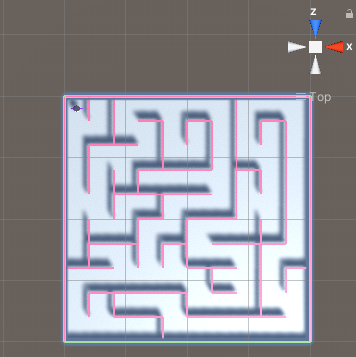

To see your map in a top-down view, right-click where it says 'Persp' in the top right of the Scene view and choose **Top**. 

You can use the arrow keys to move left and right and zoom. Hold the right mouse button down and drag to move and rotate.

To return to the normal view, right-click on **Top** and choose **Free**.

