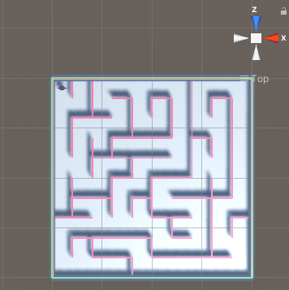

Pour voir ta scène en vue de dessus, fais un clic droit à l'endroit où il est écrit « Persp » en haut à droite de la vue Scene et choisis **Top**.

Tu peux utiliser les touches fléchées pour te déplacer à gauche et à droite et zoomer. Maintiens le bouton droit de la souris enfoncé et fais glisser pour déplacer et faire pivoter.

Pour revenir à la vue normale, fais un clic droit sur **Top** et choisis **Free**.

